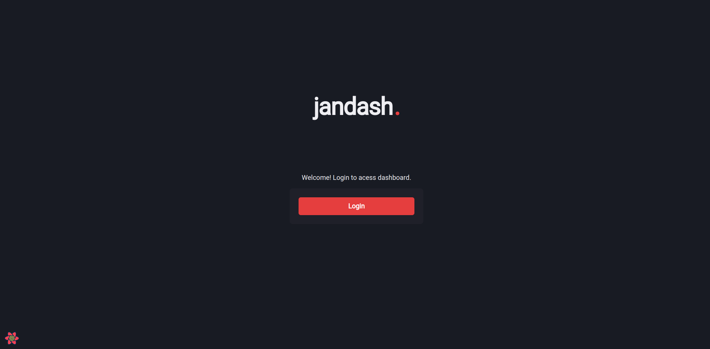
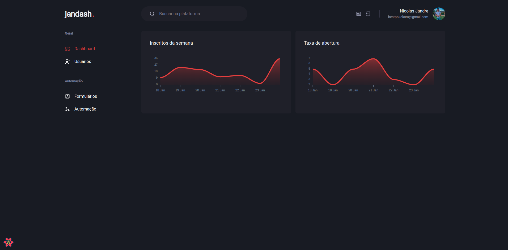
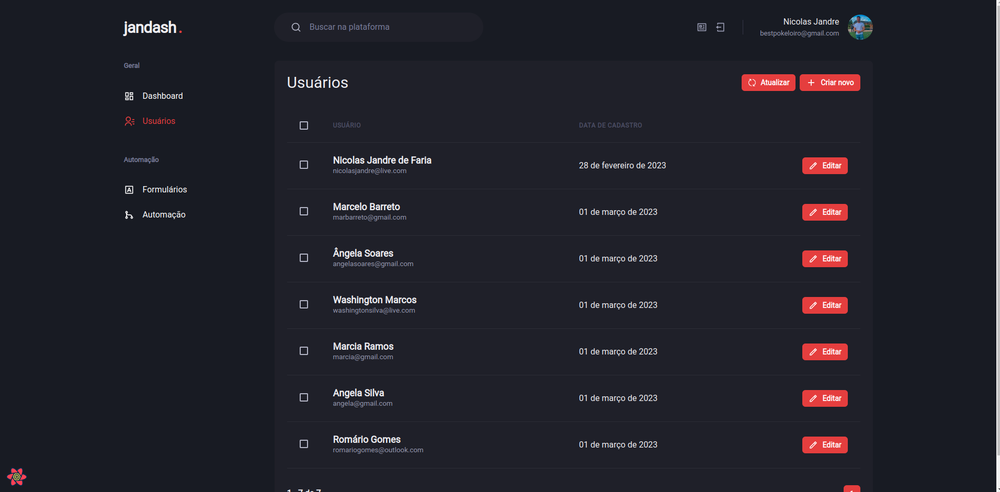
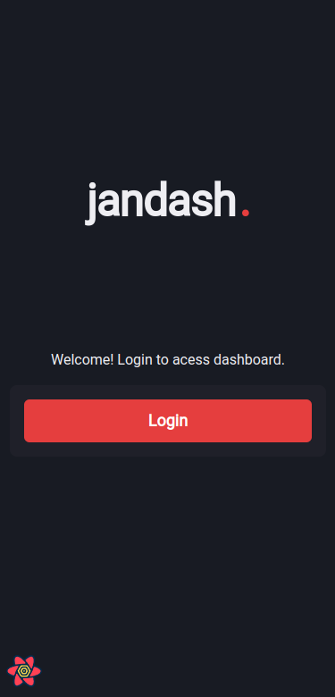
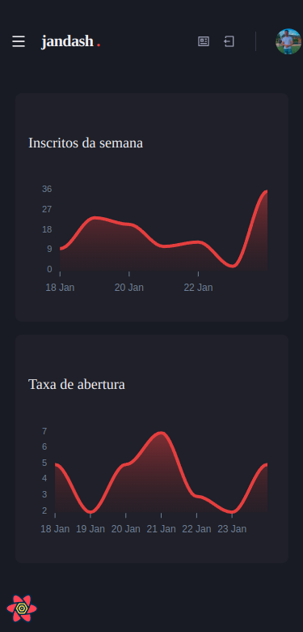
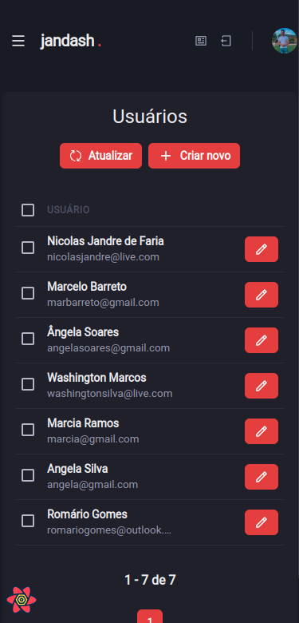

<h1 align="center">jandash.</h1>

Projeto desenvolvido durante a trilha Ignite do RocketSeat, porém acrescentei um banco de dados real e utilizei auth0 como método de autenticação.

 

Tecnologias utilizadas:
 NextJS
 Typescript
 FaunaDB
 Auth0
 React Query
 React Hook Form
 yup
 Apex Charts
 Chakra UI
 Git e GitHub

